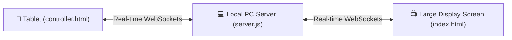

# 🌟 Virtual Oil Lamp Ceremony — Dual Screen Setup Guide

Welcome to the **Virtual Oil Lamp Ceremony**! This application is designed specifically for premium events, allowing you to walk around with a tablet (acting as the controller) to light the virtual oil lamp displayed on a separate large screen (projector, TV, or stage screen) in real time.

---

## 📐 Architecture & Dual-Screen Sync

The system uses a lightweight Node.js back-end with **Native WebSockets** to communicate:



- **Tablet (Controller):** Displays the active guest name, current wick number, a large interactive touch flame button, and a **Guest Lineup Manager** where you can add/remove guests or drag-and-drop to reorder them live.
- **Large Screen (Display):** Displays the oil lamp altar, custom candle wicks, ambient particle flames, sound synthesis (dynamic chime frequencies for each wick lit), and the final climax logo reveal.
- **Auto-Sync:** Standard WebSockets handle instantaneous actions. An offline `localStorage` mechanism serves as a backup fallback.

---

## 🚀 Quick Start Guide

### 1. Start the Server
Open a terminal in this project directory and start the Node.js server:
```bash
node server.js
```
The server will boot up and print the connection links for both screens:
```text
=============================================================
       🌟 VIRTUAL OIL LAMP LIGHTING CEREMONY SERVER 🌟       
=============================================================
Local Web Server running at: http://localhost:8000

To connect your Tablet (Tab) over Wi-Fi, open this URL:
 👉 http://<YOUR_LOCAL_IP>:8000/controller.html

Display Screen (Projector/TV) URL:
 👉 http://localhost:8000/index.html
=============================================================
```

### 2. Configure the Large Screen (Display)
1. On the PC connected to the stage screen or projector, open a browser and go to:
   `http://localhost:8000/index.html`
2. Enter fullscreen mode in your browser (press **F11**).
3. Ensure the browser volume is turned up to hear the synthesized chimes and the finale chord.

### 3. Connect the Tablet (Controller)
1. Connect your tablet to the **same Wi-Fi router** as the host PC.
2. Open a browser on the tablet and navigate to the IP address printed in your terminal, for example:
   `http://<YOUR_LOCAL_IP>:8000/controller.html`
3. Add the page to the tablet's home screen or run it full screen for an app-like experience.

---

## 🎭 How the Ceremony Works

1. **Guest Lineup:**
   On the tablet, pre-populate the names and designations of the guests in the order they will light the lamp. You can:
   - Add new guests via the input fields at the bottom.
   - Delete guests using the `✕` button.
   - Reorder the guest lineup using the drag handle `☰` on the left.
2. **Lighting a Wick:**
   - Go to a guest with the tablet.
   - Once they are ready, tap the golden **"TOUCH TO LIGHT"** button on the tablet.
   - The button will trigger a haptic pulse on the tablet and shoot a **glowing Bezier-arc spark** from the source flame to the lamp wick on the large screen.
   - The wick will light up with a particle burst, the guest's name will float up from the flame, and a premium **announcement banner** will display at the top of the screen.
   - A soft synthesized harmonic chime will play.
   - The controller button will temporarily lock for **2.5 seconds** to prevent double-tap accidents, allowing the visual flow to complete.
3. **Climax Climax (Finale Reveal):**
   - Once the last wick is lit (or by pressing **Trigger Finale** on the tablet / drawer), the altar will vibrate, shatter into energy dust, and reveal your company/event logo accompanied by a warm major chord synthesizer swell.

---

## ⚙️ Display Configurations & Shortcut Keys

Pressing **`C`** on the display screen's keyboard opens the settings drawer. You can also hover/click the gear icon `⚙` in the bottom-right corner.

| Key Shortcut | Action |
|:---|:---|
| **`C`** | Open / Close Settings Drawer |
| **`Enter` / `Space`** | Trigger next wick manually (Single-screen backup) |
| **`R`** | Quick reset the entire altar ceremony (extinguish all wicks) |
